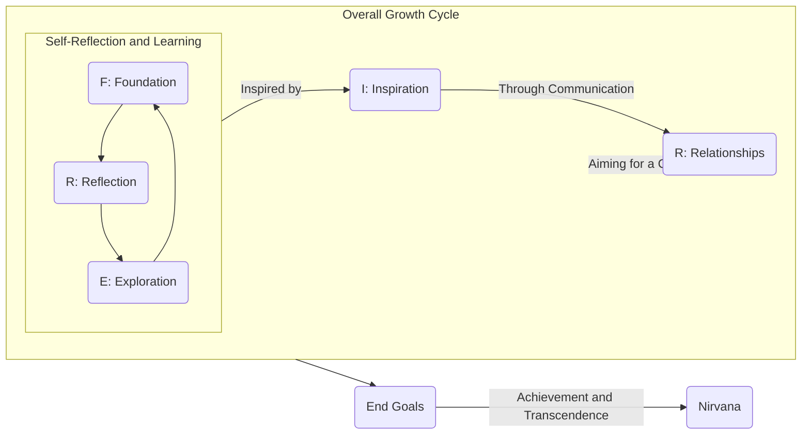

# Framework-FRIEREN

Framework-FRIERENは、技術者およびプロフェッショナルのための包括的な自己成長フレームワークです。基礎から始まり、キャリアと人生の目標に向けて進化し続けることを目指しています。このフレームワークは、継続的な学習、自己反省、インスピレーションの促進、そして社会への貢献を通じて、個人の全体的な成長をサポートします。

## フレームワークの構成要素

- **Foundation (基礎)**: 強固な技術的基礎を築きます。
- **Reflection (反省)**: 自己の行動や経験から学び、自己改善を図ります。
- **Inspiration (触発)**: 技術やアイデアで自分自身や周囲を触発します。
- **Exploration (探求)**: 新しい知識、技術、アイデアを求めて探索します。
- **Relationships (人間関係)**: 良好な人間関係を築き、チームワークを強化します。
- **End Goals (目標)**: 長期的なキャリアと人生の目標に向かって進みます。
- **Nirvana (涅槃)**: 技術的、職業的成長を超え、精神的な満足と内面的な平和を追求します。

## 目的とビジョン

Framework-FRIERENは、個人が自分自身のポテンシャルを最大限に引き出し、技術的スキルだけでなく、人間としての成長を促進することを目指しています。このフレームワークを通じて、学習者は自己実現の旅において、明確なガイドラインとサポートを得ることができます。

## 使い方

各セクションには、目標の設定、学習リソースの提案、実践的なアクションアイテムが含まれています。利用者は、このフレームワークを個人の学習スタイルやキャリア目標に合わせてカスタマイズし、自分自身の成長プランを作成することができます。

## コミュニティ

Framework-FRIEREN、学習と成長を共有し、お互いを支え合うコミュニティの構築を目指しています。フィードバック、質問、または成功体験を共有したい場合は、ぜひ私たちのコミュニティに参加してください。

## ライセンス

このプロジェクトは[MITライセンス](LICENSE)の下で公開されています。

## 貢献

このフレームワークの改善に貢献したい方は、プルリクエストを送信するか、イシューを開いてください。あなたの知見と経験は、コミュニティ全体の成長に貢献することができます。

