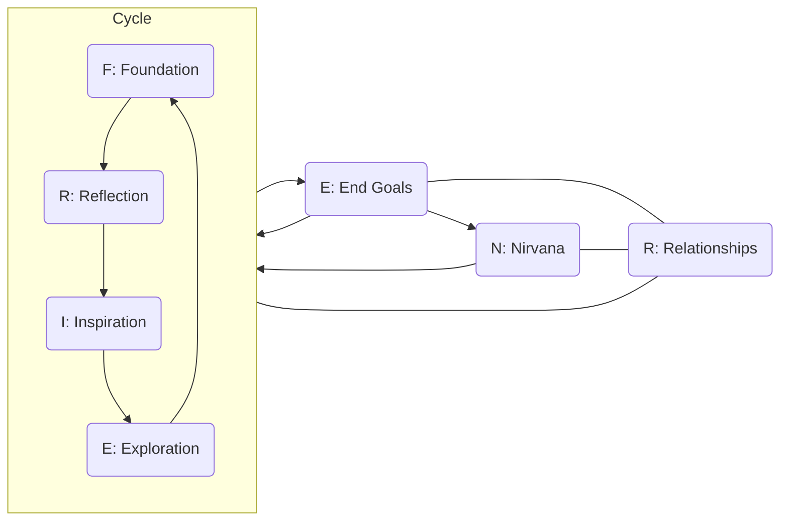

# Framework-FRIEREN

Framework-FRIERENは、技術者およびプロフェッショナルのための包括的な自己成長フレームワークです。基礎から始まり、キャリアと人生の目標に向けて進化し続けることを目指しています。このフレームワークは、継続的な学習、自己反省、インスピレーションの探求、そして社会への貢献を通じて、個人の全体的な成長をサポートします。

## フレームワークの構成要素

- **Foundation (基礎)**: 自律的に専門分野の基礎知識とスキルを身につけます。
- **Reflection (反省)**: 自己理解を深め、経験から学び、自己改善の指針とします。
- **Inspiration (触発)**: 内なる創造性と情熱を呼び覚まし、新しいアイデアや挑戦に取り組みます。
- **Exploration (探求)**: 専門外の領域にも積極的に触れ、知識と視野を広げます。
- **Relationships (人間関係)**: 多様な人々とつながり、協働とイノベーションを促進します。
- **End Goals (目標)**: 自分の人生の目的や長期的な目標を明確にし、実現への道筋を描きます。
- **Nirvana (涅槃)**: 自己実現を果たし、社会に意義ある貢献をしながら、内面的な平和と充実感を得ます。

## 目的とビジョン

Framework-FRIERENは、個人が自分自身のポテンシャルを最大限に引き出し、技術的スキルだけでなく、人間としての成長を促進することを目指しています。このフレームワークを通じて、学習者は自己実現の旅において、明確なガイドラインとサポートを得ることができます。

## 使い方

各セクションには、目標の設定、実践的なアクションプラン、自己成長のためのリソースが含まれています。利用者は、このフレームワークを個人の学習スタイルやキャリア目標に合わせてカスタマイズし、自分自身の成長プランを作成することができます。

## コミュニティ

Framework-FRIERENは、学習と成長を共有し、お互いを支え合うコミュニティの構築を目指しています。フィードバック、質問、または成功体験を共有したい場合は、ぜひ私たちのコミュニティに参加してください。

## ライセンス

このプロジェクトは[MITライセンス](LICENSE)の下で公開されています。

## 貢献

このフレームワークの改善に貢献したい方は、プルリクエストを送信するか、イシューを開いてください。あなたの知見と経験は、コミュニティ全体の成長に貢献することができます。
